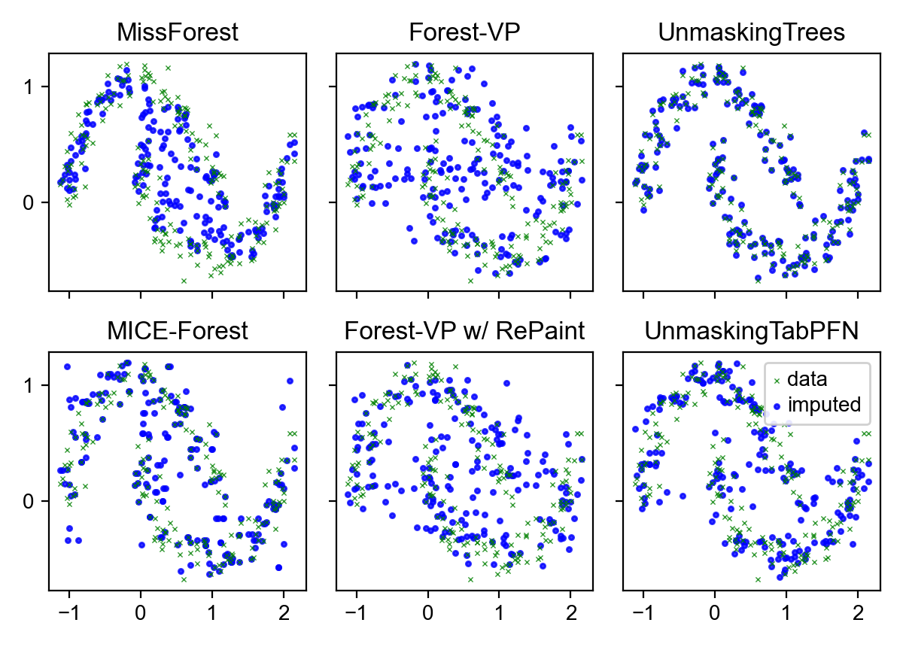
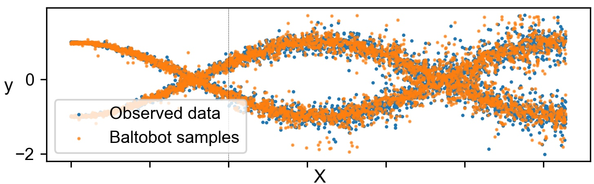

# unmasking-trees 😷➡️🥳 🌲🌲🌲

[](https://badge.fury.io/py/utrees)
[](https://pepy.tech/project/utrees)

UnmaskingTrees is a method for tabular data generation and imputation. It's an order-agnostic autoregressive diffusion model, wherein a training dataset is constructed by incrementally masking features in random order. Per-feature gradient-boosted trees are then trained to unmask each feature. Read more about it in my [paper](https://arxiv.org/abs/2407.05593)!

To better model conditional distributions which are multi-modal ("modal" as in "modes", not as in "modalities"), we hierarchically partition each feature, recursively training XGBoost classifiers at each node of the binary "meta-tree". This approach for conditional modeling of individual features, dubbed BaltoBot, outperforms quantile regression and diffusion-based probabilistic prediction. You can also customize quantization via the `quantize_cols` parameter in the `fit` method. Provide a list of length `n_dims`, with values in `('continuous', 'categorical', 'integer')`. Given `categorical` it currently skips quantization of that feature. 

<figure>
  <figcaption><i>Here's how well <a href="https://github.com/calvinmccarter/unmasking-trees/blob/master/paper/moons.ipynb">UnmaskingTrees works</a> on imputation with the Two Moons synthetic dataset:</i></figcaption>
  
</figure>

<figure>
  <figcaption><i>Here's how well <a href="https://github.com/calvinmccarter/unmasking-trees/blob/master/paper/wave.ipynb">BaltoBot works</a> on probabilistic prediction:</i></figcaption>
  
</figure>

## Installation 

### Installation from PyPI
```
pip install utrees
```

### Installation from source
After cloning this repo, install the dependencies on the command-line, then install utrees:
```
pip install -r requirements.txt
pip install -e .
pytest
```

## Usage

Check out [this notebook](https://github.com/calvinmccarter/unmasking-trees/blob/master/paper/moons.ipynb) with the Two Moons example, or [this one](https://github.com/calvinmccarter/unmasking-trees/blob/master/paper/iris.ipynb) with the Iris dataset.

### Synthetic data generation

You can fit `utrees.UnmaskingTrees` the way you would an sklearn model, with the added option that you can call `fit` with `quantize_cols`, a list to specify which columns are continuous (and therefore need to be discretized). By default, all columns are assumed to contain continuous features.

```
import numpy as np
from sklearn.datasets import make_moons
from utrees import UnmaskingTrees
data, labels = make_moons((100, 100), shuffle=False, noise=0.1, random_state=123)  # size (200, 2)
utree = UnmaskingTrees().fit(data)
```

Then, you can generate new data:

```
newdata = utree.generate(n_generate=123)  # size (123, 2)
```

### Missing data imputation

You can fit your `UnmaskingTrees` model on data with missing elements, provided as `np.nan`. You can then impute the missing values, potentially with multiple imputations per missing element. Given an array of `(n_samples, n_dims)`, you will get back an array of size `(n_impute, n_samples, n_dims)`, where the NaNs have been replaced while the others are unchanged.

```
data4impute = data.copy()
data4impute[:, 1] = np.nan
X=np.concatenate([data, data4impute], axis=0)  # size (400, 2)
utree = UnmaskingTrees().fit(X)                                                                                    
imputeddata = utree.impute(n_impute=5)  # size (5, 400, 2)
```

You can also provide a totally new dataset to be imputed, so the model performs imputation without retraining:

```
utree = UnmaskingTrees().fit(data)                                                                                    
imputeddata = utree.impute(n_impute=5, X=data4impute)  # size (5, 200, 2)
```

### Hyperparameters

- depth: Depth of balanced binary tree for recursively quantizing each feature.
- duplicate_K: Number of random masking orders per actual sample. The training dataset will be of size `(n_samples * n_dims * duplicate_K, n_dims)`.
- xgboost_kwargs: dict to pass to XGBClassifier.
- strategy: how to quantize continuous features ('kdiquantile', 'quantile', 'uniform', or 'kmeans').
- random_state: controls randomness.


## Citing this method

Please consider citing the UnmaskingTrees [arXiv preprint](https://arxiv.org/pdf/2407.05593). The bibtex is:

```
@article{mccarter2024unmasking,
  title={Unmasking Trees for Tabular Data},
  author={McCarter, Calvin},
  journal={arXiv preprint arXiv:2407.05593},
  year={2024}
}
````

Also, please consider citing ForestDiffusion ([code](https://github.com/SamsungSAILMontreal/ForestDiffusion) and [paper](https://arxiv.org/abs/2309.09968)), which this work builds on.
